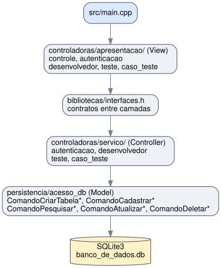
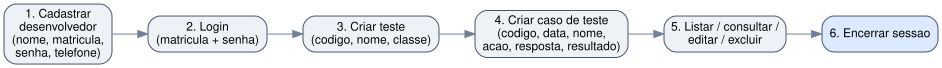

# Sistema de Gerenciamento de Testes

Trabalho 2 da disciplina **Tecnicas de Programacao 1 (TP1)** do Departamento de Ciencia da Computacao da Universidade de Brasilia. Sistema em C++ com arquitetura MVC (Model-View-Controller), persistencia em SQLite e interfaces abstratas, construido sobre os dominios e entidades do [Trabalho 1](https://github.com/GustavoVieiraDeAraujo/TB1-TP1). O sistema permite cadastrar desenvolvedores, criar testes e casos de teste, com autenticacao por matricula e senha e operacoes CRUD completas com exclusao em cascata.

---

## Sumario

- [Sistema de Gerenciamento de Testes](#sistema-de-gerenciamento-de-testes)
  - [Sumario](#sumario)
  - [Participantes](#participantes)
  - [Tecnologias](#tecnologias)
  - [Escopo do Projeto](#escopo-do-projeto)
  - [Estrutura do Projeto](#estrutura-do-projeto)
  - [Requisitos](#requisitos)
  - [Como Executar](#como-executar)
  - [Arquitetura](#arquitetura)
  - [Funcionalidades](#funcionalidades)
    - [Menu Principal](#menu-principal)
    - [Apos Login](#apos-login)
    - [Operacoes por Modulo](#operacoes-por-modulo)
  - [Modelo de Dados](#modelo-de-dados)
    - [Tabelas SQLite](#tabelas-sqlite)
    - [Exclusao em Cascata](#exclusao-em-cascata)
  - [Fluxo de Uso](#fluxo-de-uso)

---

## Participantes

| Nome                              | Matricula |
|-----------------------------------|-----------|
| Gustavo Vieira de Araujo          | 211068440 |
| Caetano Korilo                    | 212006737 |
| Arthur Antero de Sa               | 212006577 |

---

## Tecnologias

| Tecnologia    | Uso                                              |
|---------------|--------------------------------------------------|
| C++           | Linguagem de implementacao                       |
| SQLite3       | Banco de dados local para persistencia            |
| g++ (GCC)     | Compilador                                       |

---

## Escopo do Projeto

| Requisito                                          | Implementacao                                                      |
|----------------------------------------------------|--------------------------------------------------------------------|
| Arquitetura em camadas (MVC)                       | Controladoras de apresentacao + servico + interfaces abstratas      |
| Persistencia em banco de dados                     | SQLite3 com CREATE, INSERT, SELECT, UPDATE e DELETE                 |
| CRUD de Desenvolvedor                              | Cadastrar, consultar, editar e excluir (com exclusao em cascata)    |
| CRUD de Teste                                      | Cadastrar, listar, consultar, editar e excluir (com cascata)        |
| CRUD de Caso de Teste                              | Cadastrar, listar, consultar, editar e excluir                      |
| Autenticacao                                       | Login por matricula e senha                                         |
| Dominios com validacao (herdado do Trabalho 1)     | 8 dominios: Classe, Codigo, Data, Matricula, Resultado, Senha, Telefone, Texto |
| Entidades (herdado do Trabalho 1)                  | Desenvolvedor, Teste, CasoDeTeste                                   |

---

## Estrutura do Projeto

| Diretorio / Arquivo                                  | Descricao                                                  |
|------------------------------------------------------|------------------------------------------------------------|
| `src/`                                               | Ponto de entrada do sistema                                 |
| `src/main.cpp`                                       | Cria tabelas no banco e inicia o menu principal              |
| `bibliotecas/`                                       | Modelos de dados e contratos                                 |
| `bibliotecas/interfaces.h`                           | Interfaces abstratas (contratos entre camadas MVC)           |
| `bibliotecas/dominios.cpp` / `.h`                    | 8 dominios com validacao (herdado do TB1)                    |
| `bibliotecas/entidades.cpp` / `.h`                   | 3 entidades: Desenvolvedor, Teste, CasoDeTeste               |
| `bibliotecas/sqlite3.h`                              | Header oficial do SQLite3                                    |
| `controladoras/apresentacao/`                        | Camada de apresentacao (interface com o usuario)              |
| `controladoras/apresentacao/controle.cpp` / `.h`     | Menu principal e navegacao entre modulos                      |
| `controladoras/apresentacao/autenticacao.cpp` / `.h` | Tela de login (matricula + senha)                            |
| `controladoras/apresentacao/desenvolvedor.cpp` / `.h`| CRUD de desenvolvedor (telas de cadastro, consulta, edicao)  |
| `controladoras/apresentacao/teste.cpp` / `.h`        | CRUD de teste (telas de cadastro, listagem, consulta, edicao)|
| `controladoras/apresentacao/caso_teste.cpp` / `.h`   | CRUD de caso de teste (telas completas)                      |
| `controladoras/servico/`                             | Camada de servico (logica de negocio)                        |
| `controladoras/servico/autenticacao.cpp` / `.h`      | Valida credenciais contra o banco                            |
| `controladoras/servico/desenvolvedor.cpp` / `.h`     | CRUD de desenvolvedor com exclusao em cascata                |
| `controladoras/servico/teste.cpp` / `.h`             | CRUD de teste com exclusao em cascata de casos               |
| `controladoras/servico/caso_teste.cpp` / `.h`        | CRUD de caso de teste e listagem por teste                   |
| `persistencia/`                                      | Camada de acesso a dados                                     |
| `persistencia/acesso_db.cpp` / `.h`                  | Comandos SQL: CREATE, INSERT, SELECT, UPDATE, DELETE         |

---

## Requisitos

- Compilador C++: `g++` (GCC)
- SQLite3 (header incluso no projeto)

```bash
# Ubuntu/Debian
sudo apt install build-essential libsqlite3-dev
```

---

## Como Executar

```bash
g++ -o executar src/main.cpp persistencia/acesso_db.cpp bibliotecas/dominios.cpp bibliotecas/entidades.cpp \
    controladoras/apresentacao/*.cpp controladoras/servico/*.cpp -lsqlite3
./executar
```

O banco SQLite (`banco_de_dados.db`) e criado automaticamente na primeira execucao com as tabelas: `desenvolvedores`, `testes` e `casos_teste`.

---

## Arquitetura

O projeto segue o padrao MVC com 4 camadas separadas por interfaces abstratas:



---

## Funcionalidades

### Menu Principal

| Opcao | Funcionalidade |
|-------|----------------|
| 1     | Acessar o sistema (login por matricula + senha) |
| 2     | Cadastrar-se no sistema (novo desenvolvedor) |
| 3     | Encerrar execucao |

### Apos Login

| Opcao | Modulo |
|-------|--------|
| 1     | Servicos de Desenvolvedor |
| 2     | Servicos de Teste |
| 3     | Servicos de Caso de Teste |
| 4     | Encerrar sessao |

### Operacoes por Modulo

| Modulo          | Operacoes                                                           |
|-----------------|---------------------------------------------------------------------|
| Desenvolvedor   | Consultar dados, editar dados, excluir conta (cascata: testes + casos) |
| Teste           | Criar, listar todos, consultar por codigo, editar, excluir (cascata: casos) |
| Caso de Teste   | Criar, listar por teste, consultar por codigo, editar, excluir       |

---

## Modelo de Dados

### Tabelas SQLite

| Tabela           | Colunas                                                    | Chave Estrangeira |
|------------------|------------------------------------------------------------|-------------------|
| `desenvolvedores`| MATRICULA (PK), NOME, SENHA, TELEFONE                      | Nenhuma            |
| `testes`         | CODIGO (PK), NOME, CLASSE, MATRICULA_CRIADOR               | → desenvolvedores |
| `casos_teste`    | CODIGO (PK), DATA, NOME, ACAO, RESPOSTA, RESULTADO, CODIGO_TESTE_ASSOCIADO | → testes |

### Exclusao em Cascata

- Excluir **desenvolvedor** → remove todos os seus **testes** → remove todos os **casos de teste** de cada teste
- Excluir **teste** → remove todos os seus **casos de teste**

---

## Fluxo de Uso



---

> Documentacao gerada com auxilio de IA.
